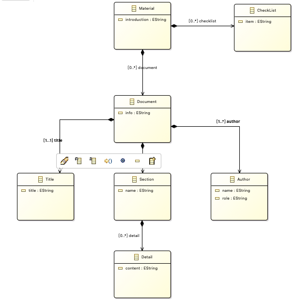
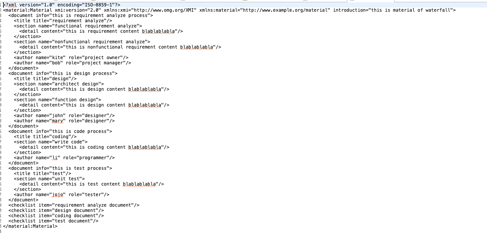

# ATL

## 元模型截图

输入端元模型：SPEM

输出端元模型：Document

模型说明：软件工程过程中有很多文档，希望通过这个转换工具，能够自动化的将软件工程过程中的各个环节中的文档自动生成。

设计的映射条件如下：

SPEM： Material 过程模型对应一份文档材料，模型名称转为材料介绍信息

WorkBreakdownElement： CheckList 过程环节中的每一个环节对应一个清单项

WorkBreakdownElement :  Document 软件工程过程中每个环节对应一个文档，如需求分析对应需求文档

WorkBreakdownElement.name : Document.title 环节名称对应文档标题

WorkBreakdownElement.description : Document.info 环节描述对应文档介绍

Activity ： Document.section 环节中的活动对应文档各个小节，如功能需求分析对应需求文档中的功能模块小节

Activity.content: Document.detail 每个活动中的具体内容对应文档的各个小节的具体内容

ProcessPerformer： Document.author 活动的执行者对应到文档的作者

## 模型截图

该截图是有过程元模型定义的瀑布模型一部分，包含了需求分析、设计、编码、测试等

该截图是转换生成的材料模型，是材料中包含了四个文档，分别是需求文档、设计文档、编码文档与测试文档

## 更新内容

完善了模型的转换，修改了语法，使得映射关系更加清楚。

