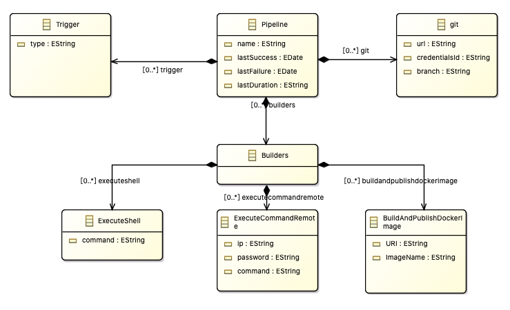
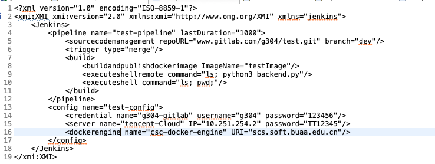

# ATL

## 输入元模型

## 输出元模型

pipeline是文件的根结点

git是源代码管理信息，url是仓库地址，branch是监听分支，从Jenkins的Pipeline的SourceCodeManageMent获得；credentialsId是凭证信息存储在Jenkins的config中的名字，从Jenkins的Config的Credential获取

Trigger是触发条件，直接从Jenkins的Pipeline的Trigger获得

Builders是指流水线的构建动作，它包含以下三个：

ExecuteShell：执行shell命令，属性为command，对应输入模型ExecuteShell

ExecuteCommandRemote：在远程服务器执行shell命令，对应输入模型的ExecuteShellRemote（获取命令）和Server（获取Ip和password）的合并

BuildAndPublishDockerImage：构建并发布Docker镜像，对应输入模型的DockerEngine（获取URI）和BuildAndPublishDockerImage（获得URI）

## 输入端模型

## 输出模型

