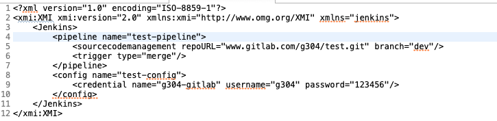

# ATL

## 输入元模型

## 输出元模型

pipeline是文件的根结点

git是源代码管理信息，url是仓库地址，branch是监听分支，从Jenkins的Pipeline的SourceCodeManageMent获得；credentialsId是凭证信息存储在Jenkins的config中的名字，从Jenkins的Config的Credential获取

Trigger是触发条件，直接从Jenkins的Pipeline的Trigger获得

## 输入端模型

## 输出模型

