# LabAssistant

  目前北航实验室团队日常管理依靠人工+微信方式进行管理，现有的商用及开源项目管理系统不能满足日常管理的需要，现需要开发一套团队管理系统支持实验室日常活动管理。
## 团队日常活动:
1. 组会相关活动(预定、通知、签到、纪要、总结) 
2. 实验室团队介绍(老师、学生、合作、项目)
3. 日常计划(每年/每学期/每周工作计划、计划监督) 
4. 周报管理(本周任务、本周完成情况、存在的问题) 
5. 资料管理与共享

## 项目分工

SY2121107 蹇熠辉：实验室团队介绍、资料管理与共享的需求分析 EARS编写 UML建模 合约编写

ZY2121112 田宏远：日常计划的需求分析 EARS编写 UML建模 合约编写

ZY2121110 孟涛：周报管理的需求分析 EARS编写 UML建模 合约编写

ZY2121103 邓程诺：组会相关活动的需求分析 EARS编写 UML建模 合约编写

## 三次迭代

### 第一次迭代

commit id: 7215568f

#### 用例图

**分工如下**

* SY2121107 蹇熠辉：
* ZY2121112 田宏远：User-managePlans Teacher-supervisePlans
* ZY2121110 孟涛：Teacher - (createWeekly、assignTask)、User-viewWeekly、Student-(updateTaskProcession、reportProblem)
* ZY2121103 邓程诺：

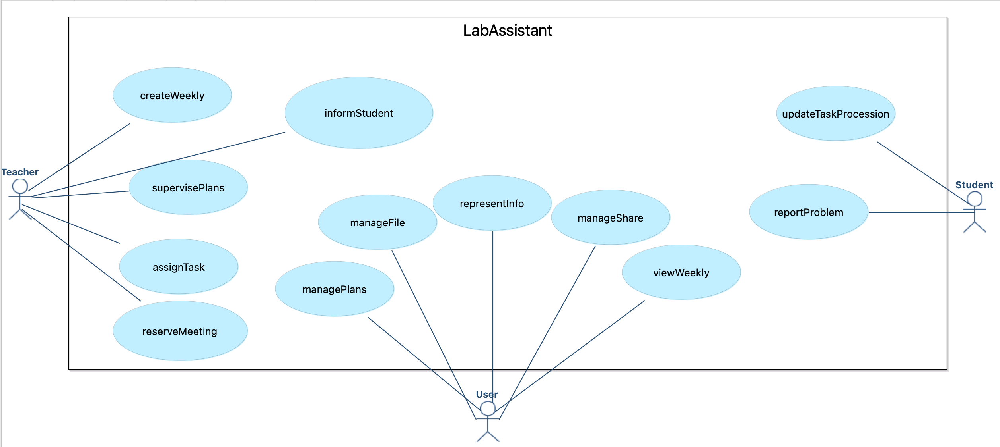

#### 类图

**分工如下**

* SY2121107 蹇熠辉：
* ZY2121112 田宏远：User、Plan、Review
* ZY2121110 孟涛：Weekly、Task
* ZY2121103 邓程诺：

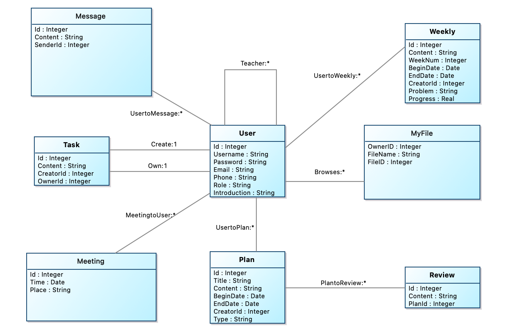

#### 顺序图

**分工如下：**

* SY2121107 蹇熠辉：
* ZY2121112 田宏远：SupervisePlansService
* ZY2121110 孟涛：CreateWeeklyService、AssignTaskService、ViewWeeklyService、UpdateTaskService、ReportProblemService
* ZY2121103 邓程诺：

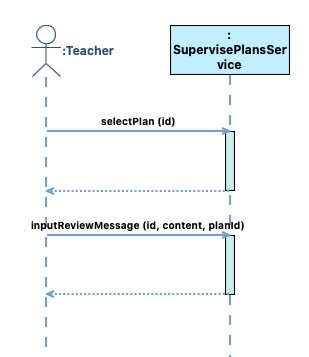

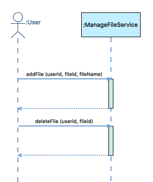

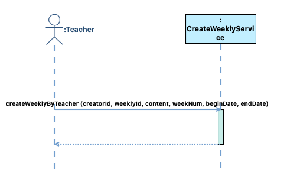

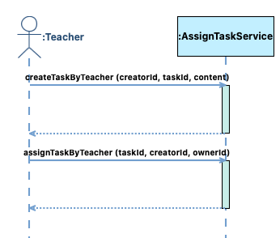

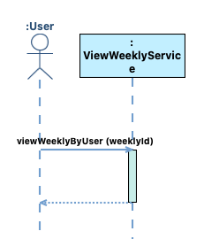

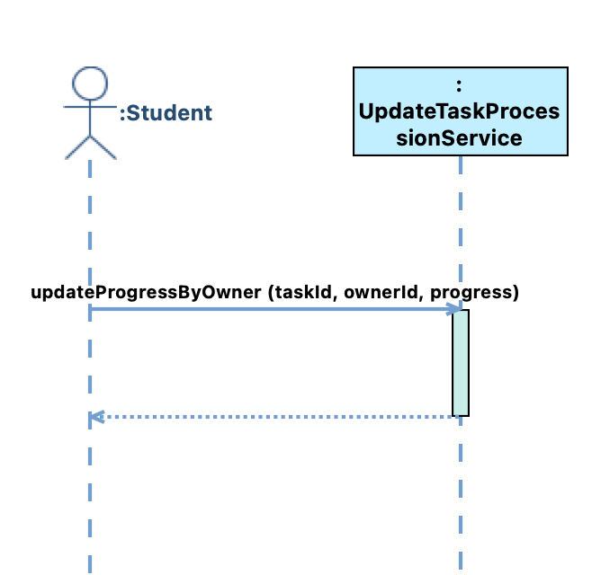

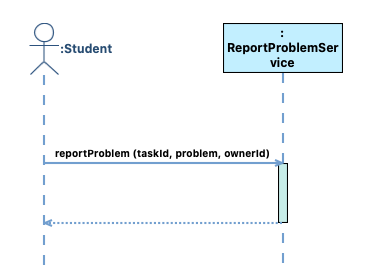

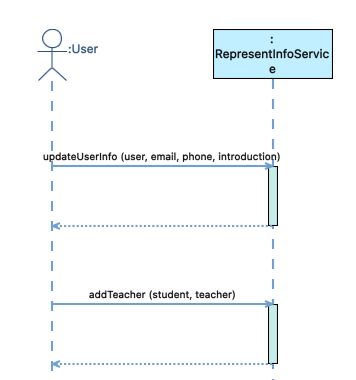

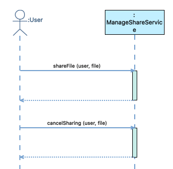

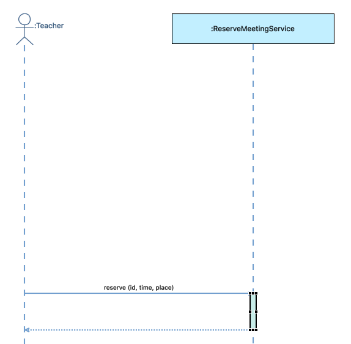

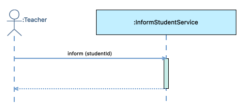

#### OCL合约

**分工如下：**

* SY2121107 蹇熠辉：
* ZY2121112 田宏远：ManagePlansService - (createPlan、queryPlanById、modifyPlan、deletePlan)、SupervisePlansService- （selectPlan、inputReviewMessage）
* ZY2121110 孟涛：CreateWeeklyService、AssignTaskService 、ViewWeeklyService、UpdateTaskProcessionService、ReportProblemService以及相关操作与合约
* ZY2121103 邓程诺：

```
Service ManagePlansService {

		[Operation]
		inputPlanInformation(plan)
		createPlan(id, title, content, beginDate, endDate, creatorId, type)
		queryPlanById(id)
		modifyPlan(id, title, content, beginDate, endDate, creatorId, type)
		deletePlan(id)

	}

	Service SupervisePlansService {

		[Operation]
		selectPlan(id)
		inputReviewMessage(id, content, planId)

	}

	Service ManageFileService {

		[Operation]
		addFile(userid, fileid, fileName)
		deleteFile(userid, fileid)

	}

	Service CreateWeeklyService {

		[Operation]
		createWeeklyByTeacher(creatorId, weeklyId, content, weekNum, beginDate, endDate)

	}

	Service AssignTaskService {

		[Operation]
		assignTaskByTeacher(taskId, creatorId, ownerId)
		createTaskByTeacher(creatorId, taskId, content)

	}

	Service ViewWeeklyService {

		[Operation]
		viewWeeklyByUser(weeklyId)

	}

	Service UpdateTaskProcessionService {

		[Operation]
		updateProgressByOwner(taskId, ownerId, progress)

	}

	Service ReportProblemService {

		[Operation]
		reportProblem(taskId, problem, ownerId)

	}

	Service RepresentInfoService {

		[Operation]
		updateUserInfo(user, email, phone, introduction)
		addTeacher(student, teacher)

	}

	Service ManageShareService {

		[Operation]
		shareFile(user, file)
		cancelSharing(user, file)

	}

	Service ReserveMeetingService {

		[Operation]
		reserve(id, password, time, place)

	}

	Service InformStudentService {

		[Operation]
		inform(student)

	}

	Contract ManagePlansService::inputPlanInformation(plan) : Boolean {

		precondition:
			true
		postcondition:
			true
	}

	Contract ManagePlansService::createPlan(id : Integer, title : String, content : String, beginDate : Date, endDate : Date, creatorId : Integer, type : String) : Boolean {

		definition:
			plan:Plan = Plan.allInstance()->any(pla:Plan | pla.Id = id)

		precondition:
			plan.oclIsUndefined() = true

		postcondition:
			let pla:Plan in
			pla.oclIsNew() and
			pla.Id = id and
			pla.Title = title and
			pla.Content = content and
			pla.BeginDate = beginDate and
			pla.EndDate = endDate and
			pla.CreatorId = creatorId and
			pla.Type = type and
			Plan.allInstance()->includes(pla) and
			result = true
	}

	Contract ManagePlansService::queryPlanById(id : Integer) : Boolean {

		definition:
			plan:Plan = Plan.allInstance()->any(pla:Plan | pla.Id = id)

		precondition:
			plan.oclIsUndefined() = false

		postcondition:
			result = plan
	}

	Contract ManageFileService::addFile(userid : Integer, fileid : Integer, fileName : String) : Boolean {

		definition:
			user:User = User.allInstance()->any(use:User | use.Id = userid),
			fff:MyFile = MyFile.allInstance()->any(fffff:MyFile | fffff.FileID = fileid)

		precondition:
			fff.oclIsUndefined() = true and
			user.oclIsUndefined() = false

		postcondition:
			let fff:MyFile in
			fff.oclIsNew() and
			fff.OwnerID = userid and
			fff.FileName = fileName and
			fff.FileID = fileid and
			MyFile.allInstance()->includes(fff) and
			result = true
	}

	Contract ManageFileService::deleteFile(userid : Integer, fileid : Integer) : Boolean {

		definition:
			fff:MyFile = MyFile.allInstance()->any(fffff:MyFile | fffff.FileID = fileid),
			usr:User = User.allInstance()->any(uuuuu:User | uuuuu.Id = userid)

		precondition:
			fff.oclIsUndefined() = false and
			usr.oclIsUndefined() = false and
			MyFile.allInstance()->includes(fff) and
			User.allInstance()->includes(usr)

		postcondition:
			MyFile.allInstance()->excludes(fff) and
			result = true
	}

	Contract CreateWeeklyService::createWeeklyByTeacher(creatorId : String, weeklyId : String, content : String, weekNum : String, beginDate : String, endDate : String) : Boolean {

		definition:
			weekly:Weekly = Weekly.allInstance()->any(wl:Weekly | wl.Id = weeklyId)

		precondition:
			weekly.oclIsUndefined() = true

		postcondition:
			let wl:Weekly in
			wl.oclIsNew() and
			wl.Id = weeklyId and
			wl.CreatorId = creatorId and
			wl.Content = content and
			wl.BeginDate = beginDate and
			wl.EndDate = endDate and
			wl.Weeknum = weekNum and
			Weekly.allInstance()->includes(wl) and
			result = true
	}

	Contract AssignTaskService::createTaskByTeacher(creatorId : String, taskId : String, content : String) : Boolean {

		definition:
			task:Task = Task.allInstance()->any(tk:Task | tk.Id = taskId)

		precondition:
			task.oclIsUndefined() = true

		postcondition:
			let tk:Task in
			tk.oclIsNew() and
			tk.Id = taskId and
			tk.CreatorId = creatorId and
			tk.Content = content and
			Task.allInstance()->includes(tk) and
			result = true
	}

	Contract AssignTaskService::assignTaskByTeacher(taskId : String, creatorId : String, ownerId : String) : Boolean {

		definition:
			tk:Task = Task.allInstance()->any(t:Task | t.Id = taskId)

		precondition:
			tk.oclIsUndefined() = false and
			tk.CreatorId = creatorId
		postcondition:
			tk.OwnerId = ownerId and
			result = true
	}

	Contract ViewWeeklyService::viewWeeklyByUser(weeklyId : String) : Weekly {

		definition:
			wk:Weekly = Weekly.allInstance()->any(w:Weekly | w.Id = weekId)

		precondition:
			wk.oclIsUndefined() = false
		postcondition:
			result = wk
	}

	Contract UpdateTaskProcessionService::updateProgressByOwner(taskId : String, ownerId : String, progress : String) : Boolean {

		definition:
			tk:Task = Task.allInstance()->any(t:Task | t.Id = taskId)

		precondition:
			tk.oclIsUndefined() = false and
			tk.OwnerId = ownerId
		postcondition:
			tk.Progress = progress and
			result = true
	}

	Contract ReportProblemService::reportProblem(taskId : String, problem : String, ownerId : String) : Boolean {

		definition:
			tk:Task = Task.allInstance()->any(t:Task | t.Id = taskId)

		precondition:
			tk.oclIsUndefined() = false and
			tk.OwnerId = ownerId
		postcondition:
			tk.Problem = problem and
			result = true
	}

	Contract RepresentInfoService::updateUserInfo(user : Integer, email : String, phone : String, introduction : String) : Boolean {

		definition:
			uuu:User = User.allInstance()->any(u:User | u.Id = user)

		precondition:
			uuu.oclIsUndefined() = false

		postcondition:
			uuu.Email = email and
			uuu.Phone = phone and
			uuu.Introduction = introduction and
			result = true
	}

	Contract RepresentInfoService::addTeacher(student : Integer, teacher : Integer) : Boolean {

		definition:
			stu:User = User.allInstance()->any(u:User | u.Id = student),
			tea:User = User.allInstance()->any(u:User | u.Id = teacher)

		precondition:
			stu.oclIsUndefined() = false and
			tea.oclIsUndefined() = false

		postcondition:
			stu.Teacher = tea and
			result = true
	}

	Contract ManageShareService::shareFile(user : Integer, file : Integer) : Boolean {

		definition:
			uuu:User = User.allInstance()->any(u:User | u.Id = user),
			fff:MyFile = MyFile.allInstance()->any(f:MyFile | f.FileID = file)

		precondition:
			uuu.oclIsUndefined() = false and
			fff.oclIsUndefined() = false and
			uuu.Browses->excludes(fff)

		postcondition:
			uuu.Browses->includes(fff) and
			result = true
	}

	Contract ManageShareService::cancelSharing(user : Integer, file : Integer) : Boolean {

		definition:
			uuu:User = User.allInstance()->any(u:User | u.Id = user),
			fff:MyFile = MyFile.allInstance()->any(f:MyFile | f.FileID = file)

		precondition:
			uuu.oclIsUndefined() = false and
			fff.oclIsUndefined() = false and
			uuu.Browses->includes(fff)

		postcondition:
			uuu.Browses->excludes(fff) and
			result = true
	}

	Contract ManagePlansService::modifyPlan(id : Integer, title : String, content : String, beginDate : Date, endDate : Date, creatorId : Integer, type : String) : Boolean {

		definition:
			plan:Plan = Plan.allInstance()->any(pla:Plan | pla.Id = id)

		precondition:
			plan.oclIsUndefined() = true

		postcondition:
			plan.oclIsNew() and
			plan.Id = id and
			plan.Title = title and
			plan.Content = content and
			plan.BeginDate = beginDate and
			plan.EndDate = endDate and
			plan.CreatorId = creatorId and
			plan.Type = type and
			result = true
	}

	Contract ManagePlansService::deletePlan(id : Integer) : Boolean {

		definition:
			plan:Plan = Plan.allInstance()->any(pla:Plan | pla.Id = id)

		precondition:
			plan.oclIsUndefined() = false and
			Plan.allInstance()->includes(plan)

		postcondition:
			Plan.allInstance()->excludes(plan) and
			result = true
	}

	Contract SupervisePlansService::selectPlan(id: Integer) : Boolean {

		definition:
			plan:Plan = Plan.allInstance()->any(pla:Plan | pla.Id = id)

		precondition:
			plan.oclIsUndefined() = false

		postcondition:
			result = plan
	}

	Contract SupervisePlansService::inputReviewMessage(id : Integer, content : String, planId: Integer) : Boolean {

		definition:
			review:Review = Review.allInstance()->any(rew:Review | rew.Id = id)

		precondition:
			review.oclIsUndefined() = true

		postcondition:
			let rew:Review in
			rew.oclIsNew() and
			rew.Id = id and
			rew.Content = content and
			rew.PlanId = planId and
			Review.allInstance()->includes(rew) and
			result = true
	}

	Contract ReserveMeetingService::reserve(id : String, password : String, time : String, place : String) : Boolean {

		definition:
			meeting:Meeting = Meeting.allInstance()->any(mee:Meeting | mee.time = time)

		precondition:
			meeting.oclIsUndefined() = true
		postcondition:
			let mee:Meeting in
			mee.oclIsNew() and
			mee.Id = id and
			mee.Time = time and
			mee.Place = place and
			Meeting.allInstance()->includes(mee) and
			result = true
	}

	Contract InformStudentService::inform(student : String) : Boolean {

		definition:
			student:User = User.allInstance()->any(stu:User | stu.id = student)

		precondition:
			student.oclIsUndefined() = true
		postcondition:
			let stu:User in
			stu.oclIsNew() and
			stu.Id = student and
			Student.allInstance()->includes(stu) and
			result = true
	}
```


### 第二次迭代

commit id: 7b8ccc8

#### 用例图

书写人：

SY2121107 蹇熠辉：

ZY2121112 田宏远：User-managePlans Teacher-supervisePlans

ZY2121110 孟涛：Teacher - (createWeekly、assignTask)、User-viewWeekly、Student-(updateTaskProgress、reportProblem)

ZY2121103 邓程诺：

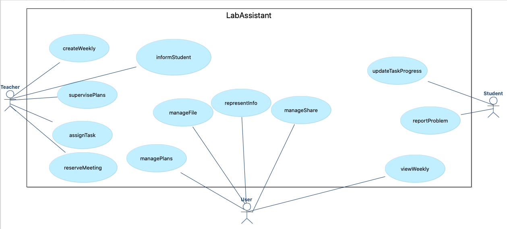

#### 类图

书写人：

SY2121107 蹇熠辉：

ZY2121112 田宏远：User Plan Review

ZY2121110 孟涛：Weekly、Task

ZY2121103 邓程诺：

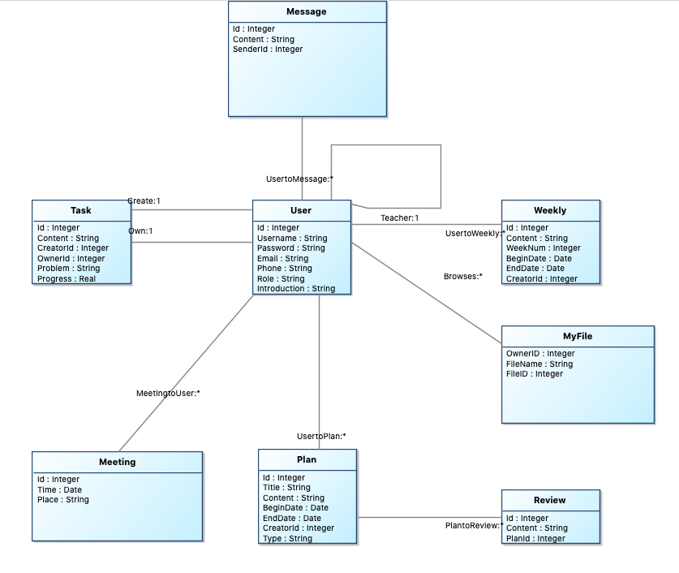

#### 顺序图

书写人：

SY2121107 蹇熠辉：

ZY2121112 田宏远：SupervisePlansService

ZY2121110 孟涛：CreateWeeklyService、AssignTaskService、ViewWeeklyService、UpdateTaskService、ReportProblemService

ZY2121103 邓程诺：


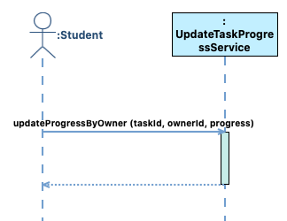


#### OCL

书写人：

SY2121107 蹇熠辉：

ZY2121112 田宏远：

+ ManagePlansService
  + createPlan、queryPlanById、modifyPlan、deletePlan
+ SupervisePlansService
  + selectPlan、inputReviewMessage

ZY2121110 孟涛：CreateWeeklyService、AssignTaskService 、ViewWeeklyService、UpdateTaskProcessionService、ReportProblemService的相关操作与合约

ZY2121103 邓程诺：

```
Service ManagePlansService {

		[Operation]
		createPlan(id, title, content, beginDate, endDate, creatorId, type)
		queryPlanById(id)
		modifyPlan(id, title, content, beginDate, endDate, creatorId, type)
		deletePlan(id)

	}

	Service SupervisePlansService {

		[Operation]
		selectPlan(id)
		inputReviewMessage(id, content, planId)

	}

	Service ManageFileService {

		[Operation]
		addFile(userid, fileid, fileName)
		deleteFile(userid, fileid)

	}

	Service CreateWeeklyService {

		[Operation]
		createWeeklyByTeacher(creatorId, weeklyId, content, weekNum, beginDate, endDate)

	}

	Service AssignTaskService {

		[Operation]
		assignTaskByTeacher(taskId, creatorId, ownerId)
		createTaskByTeacher(creatorId, taskId, content)

	}

	Service ViewWeeklyService {

		[Operation]
		viewWeeklyByUser(weeklyId)

	}

	Service UpdateTaskProgressService {

		[Operation]
		updateProgressByOwner(taskId, ownerId, progress)

	}

	Service ReportProblemService {

		[Operation]
		reportProblem(taskId, problem, ownerId)

	}

	Service RepresentInfoService {

		[Operation]
		updateUserInfo(user, email, phone, introduction)
		addTeacher(student, teacher)

	}

	Service ManageShareService {

		[Operation]
		shareFile(user, file)
		cancelSharing(user, file)

	}

	Service ReserveMeetingService {

		[Operation]
		reserve(id, time, place)

	}

	Service InformStudentService {

		[Operation]
		inform(studentId)

	}

	Contract ManagePlansService::createPlan(id : Integer, title : String, content : String, beginDate : Date, endDate : Date, creatorId : Integer, type : String) : Boolean {

		definition:
			plan:Plan = Plan.allInstance()->any(pla:Plan | pla.Id = id)

		precondition:
			plan.oclIsUndefined() = true

		postcondition:
			let pla:Plan in
			pla.oclIsNew() and
			pla.Id = id and
			pla.Title = title and
			pla.Content = content and
			pla.BeginDate = beginDate and
			pla.EndDate = endDate and
			pla.CreatorId = creatorId and
			pla.Type = type and
			Plan.allInstance()->includes(pla) and
			result = true
	}

	Contract ManagePlansService::queryPlanById(id : Integer) : Plan {

		definition:
			plan:Plan = Plan.allInstance()->any(pla:Plan | pla.Id = id)

		precondition:
			plan.oclIsUndefined() = false

		postcondition:
			result = plan
	}

	Contract ManageFileService::addFile(userid : Integer, fileid : Integer, fileName : String) : Boolean {

		definition:
			user:User = User.allInstance()->any(use:User | use.Id = userid),
			fff:MyFile = MyFile.allInstance()->any(fffff:MyFile | fffff.FileID = fileid)

		precondition:
			fff.oclIsUndefined() = true and
			user.oclIsUndefined() = false

		postcondition:
			let newFile:MyFile in
			newFile.oclIsNew() and
			newFile.OwnerID = userid and
			newFile.FileName = fileName and
			newFile.FileID = fileid and
			MyFile.allInstance()->includes(newFile) and
			result = true
	}

	Contract ManageFileService::deleteFile(userid : Integer, fileid : Integer) : Boolean {

		definition:
			fff:MyFile = MyFile.allInstance()->any(fffff:MyFile | fffff.FileID = fileid),
			usr:User = User.allInstance()->any(uuuuu:User | uuuuu.Id = userid)

		precondition:
			fff.oclIsUndefined() = false and
			usr.oclIsUndefined() = false and
			MyFile.allInstance()->includes(fff) and
			User.allInstance()->includes(usr)

		postcondition:
			MyFile.allInstance()->excludes(fff) and
			result = true
	}

	Contract CreateWeeklyService::createWeeklyByTeacher(creatorId : Integer, weeklyId : Integer, content : String, weekNum : Integer, beginDate : Date, endDate : Date) : Boolean {

		definition:
			weekly:Weekly = Weekly.allInstance()->any(wl:Weekly | wl.Id = weeklyId)

		precondition:
			weekly.oclIsUndefined() = true

		postcondition:
			let wl:Weekly in
			wl.oclIsNew() and
			wl.Id = weeklyId and
			wl.CreatorId = creatorId and
			wl.Content = content and
			wl.BeginDate = beginDate and
			wl.EndDate = endDate and
			wl.WeekNum = weekNum and
			Weekly.allInstance()->includes(wl) and
			result = true
	}

	Contract AssignTaskService::createTaskByTeacher(creatorId : Integer, taskId : Integer, content : String) : Boolean {

		definition:
			task:Task = Task.allInstance()->any(tk:Task | tk.Id = taskId)

		precondition:
			task.oclIsUndefined() = true

		postcondition:
			let tk:Task in
			tk.oclIsNew() and
			tk.Id = taskId and
			tk.CreatorId = creatorId and
			tk.Content = content and
			Task.allInstance()->includes(tk) and
			result = true
	}

	Contract AssignTaskService::assignTaskByTeacher(taskId : Integer, creatorId : Integer, ownerId : Integer) : Boolean {

		definition:
			tk:Task = Task.allInstance()->any(t:Task | t.Id = taskId)

		precondition:
			tk.oclIsUndefined() = false and
			tk.CreatorId = creatorId
		postcondition:
			tk.OwnerId = ownerId and
			result = true
	}

	Contract ViewWeeklyService::viewWeeklyByUser(weeklyId : Integer) : Weekly {

		definition:
			wk:Weekly = Weekly.allInstance()->any(w:Weekly | w.Id = weekId)

		precondition:
			wk.oclIsUndefined() = false
		postcondition:
			result = wk
	}

	Contract UpdateTaskProgressService::updateProgressByOwner(taskId : Integer, ownerId : Integer, progress : Real) : Boolean {

		definition:
			tk:Task = Task.allInstance()->any(t:Task | t.Id = taskId)

		precondition:
			tk.oclIsUndefined() = false and
			tk.OwnerId = ownerId
		postcondition:
			tk.Progress = progress and
			result = true
	}

	Contract ReportProblemService::reportProblem(taskId : Integer, problem : String, ownerId : Integer) : Boolean {

		definition:
			tk:Task = Task.allInstance()->any(t:Task | t.Id = taskId)

		precondition:
			tk.oclIsUndefined() = false and
			tk.OwnerId = ownerId
		postcondition:
			tk.Problem = problem and
			result = true
	}

	Contract RepresentInfoService::updateUserInfo(user : Integer, email : String, phone : String, introduction : String) : Boolean {

		definition:
			uuu:User = User.allInstance()->any(u:User | u.Id = user)

		precondition:
			uuu.oclIsUndefined() = false

		postcondition:
			uuu.Email = email and
			uuu.Phone = phone and
			uuu.Introduction = introduction and
			result = true
	}

	Contract RepresentInfoService::addTeacher(student : Integer, teacher : Integer) : Boolean {

		definition:
			stu:User = User.allInstance()->any(u:User | u.Id = student),
			tea:User = User.allInstance()->any(u:User | u.Id = teacher)

		precondition:
			stu.oclIsUndefined() = false and
			tea.oclIsUndefined() = false

		postcondition:
			stu.Teacher = tea and
			result = true
	}

	Contract ManageShareService::shareFile(user : Integer, file : Integer) : Boolean {

		definition:
			uuu:User = User.allInstance()->any(u:User | u.Id = user),
			fff:MyFile = MyFile.allInstance()->any(f:MyFile | f.FileID = file)

		precondition:
			uuu.oclIsUndefined() = false and
			fff.oclIsUndefined() = false and
			uuu.Browses->excludes(fff)

		postcondition:
			uuu.Browses->includes(fff) and
			result = true
	}

	Contract ManageShareService::cancelSharing(user : Integer, file : Integer) : Boolean {

		definition:
			uuu:User = User.allInstance()->any(u:User | u.Id = user),
			fff:MyFile = MyFile.allInstance()->any(f:MyFile | f.FileID = file)

		precondition:
			uuu.oclIsUndefined() = false and
			fff.oclIsUndefined() = false and
			uuu.Browses->includes(fff)

		postcondition:
			uuu.Browses->excludes(fff) and
			result = true
	}

	Contract ManagePlansService::modifyPlan(id : Integer, title : String, content : String, beginDate : Date, endDate : Date, creatorId : Integer, type : String) : Boolean {

		definition:
			plan:Plan = Plan.allInstance()->any(pla:Plan | pla.Id = id)

		precondition:
			plan.oclIsUndefined() = true

		postcondition:
			plan.Title = title and
			plan.Content = content and
			plan.BeginDate = beginDate and
			plan.EndDate = endDate and
			plan.CreatorId = creatorId and
			plan.Type = type and
			result = true
	}

	Contract ManagePlansService::deletePlan(id : Integer) : Boolean {

		definition:
			plan:Plan = Plan.allInstance()->any(pla:Plan | pla.Id = id)

		precondition:
			plan.oclIsUndefined() = false and
			Plan.allInstance()->includes(plan)

		postcondition:
			Plan.allInstance()->excludes(plan) and
			result = true
	}

	Contract SupervisePlansService::selectPlan(id: Integer) : Plan {

		definition:
			plan:Plan = Plan.allInstance()->any(pla:Plan | pla.Id = id)

		precondition:
			plan.oclIsUndefined() = false

		postcondition:
			result = plan
	}

	Contract SupervisePlansService::inputReviewMessage(id : Integer, content : String, planId: Integer) : Boolean {

		definition:
			review:Review = Review.allInstance()->any(rew:Review | rew.Id = id)

		precondition:
			review.oclIsUndefined() = true

		postcondition:
			let rew:Review in
			rew.oclIsNew() and
			rew.Id = id and
			rew.Content = content and
			rew.PlanId = planId and
			Review.allInstance()->includes(rew) and
			result = true
	}

	Contract ReserveMeetingService::reserve(id : String, time : Date, place : String) : Boolean {

		definition:
			meeting:Meeting = Meeting.allInstance()->any(mee:Meeting | mee.time = time)

		precondition:
			meeting.oclIsUndefined() = true
		postcondition:
			let mee:Meeting in
			mee.oclIsNew() and
			mee.Id = id and
			mee.Time = time and
			mee.Place = place and
			Meeting.allInstance()->includes(mee) and
			result = true
	}

	Contract InformStudentService::inform(studentId : String) : Boolean {

		definition:
			student:User = User.allInstance()->any(stu:User | stu.id = studentId)

		precondition:
			student.oclIsUndefined() = true
		postcondition:
			let stu:User in
			stu.oclIsNew() and
			stu.Id = studentId and
			Student.allInstance()->includes(stu) and
			result = true
	}
```

#### 效果图

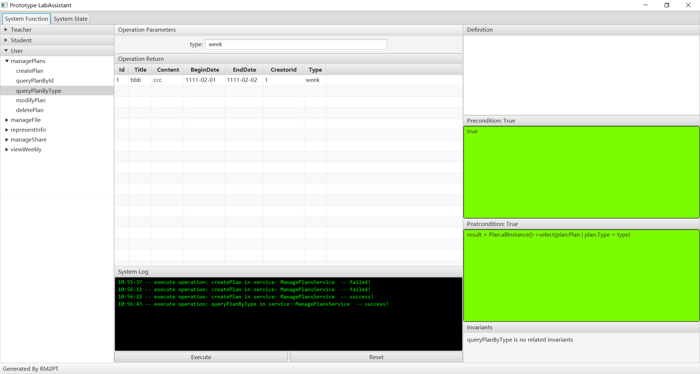

