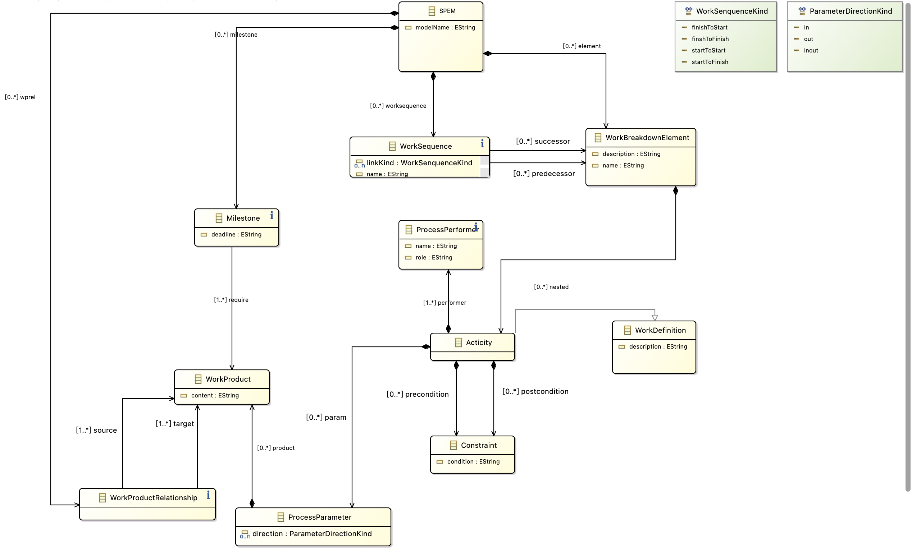
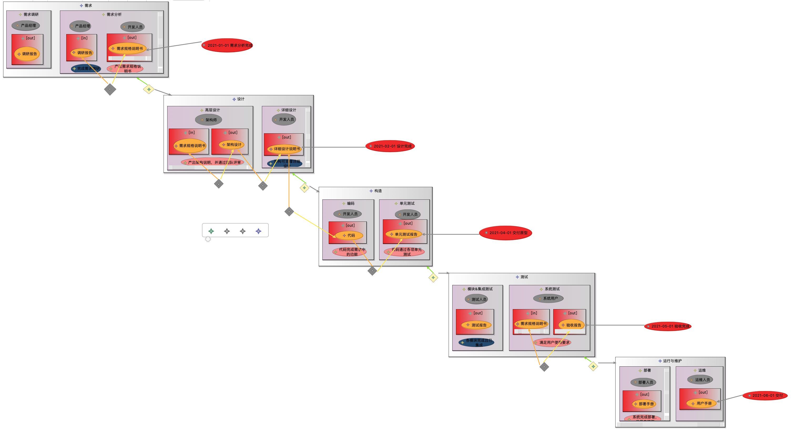
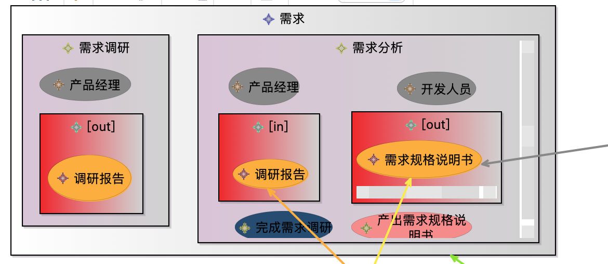
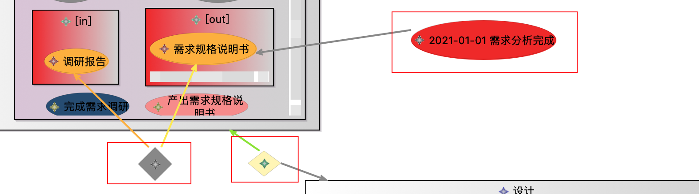

# 第二次大作业

## 1. 元模型截图

## 2. 元模型说明

* SPEM: 根结点，与之相关的关系有工作产物关联关系（wprel）、里程碑（milestone）、阶段顺序（worksequence）、工作阶段（element）
* WorkSequence: 阶段顺序，通过successor与predecessor来表明各个工作阶段的先后关系。
* WorkBreakdownElement: 工作阶段，对应软件工程过程生命周期的各个阶段，如需求分析、设计等。与之相关的关系有阶段包含的活动（nested）
* Activity：工作活动，对应不同阶段中所需要做的工作，如需求调研、编码等。与之相关的关系有前后置约束（preconditon、postcondition）、活动参数（param）、活动执行人（performer）等关系。
* ProcessPerformer：活动执行人，表示每个活动的分工。
* Constraint: 活动约束，为每个活动开始或结束需要满足的条件。
* ProcessParameter： 活动输入参数，表示每一个活动开始时需要的产物或结束后输出的产物。与之相关的便是WorkProduct（工作产物）。
* WorkProduct：工作产物，如文档或代码等。
* Milestone：里程碑，指给定时间节点所需产出的工作产物。
* WorkProductRelationship: 工作产物之间的关系，包含source和target等关系。

## 3. 图形建模截图

瀑布模型的建模实例：

## 4. 元模型与图形语言映射关系说明

上图最外层的灰色大框表示不同的工作阶段，对应WorkBreakdownElement；

内嵌的粉色框表示每个工作阶段中的工作活动，对应Activity；

粉色框中内嵌的灰色椭圆表示活动的执行人，对应ProcessPerformer；

粉丝框中内嵌的红色框表示工作产物，如第一个红色框，其中label为out，表示该活动的产出，对应WorkProcuct；

第二个粉色框中内嵌的深蓝色椭圆与浅红色椭圆分别对应活动前置与后置条件，对应Constraint;

上图中，最右侧的红色椭圆表示里程碑，其指向需求规格说明书，表示里程碑为需求规格说明书的产出，对应Milestone，其中灰色线表示require关系；

左侧的灰色菱形表示两个工作产物的关系，对应WorkProductRelationship，其中棕色的线表示source、橘色的线表示target关系；

右侧的淡黄色菱形表示工作阶段顺序关系，对应WorkSequence,其中绿色的线表示predecessor、灰色的线表示successor。

## 5. 与第一次作业区别

* 相较第一次作业，简单修改了一下元模型，使得能从SPEM根结点访问到各个节点

* 第一次建模中，仅完成了WorkSequence、WorkBreakdownElement实体建立与predecessor、successor关系的建立。这次的作业中，完善了Sirius建模，完成了各个实体、关系与图形的映射关系

