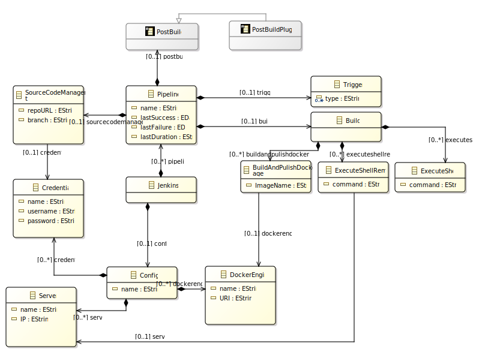
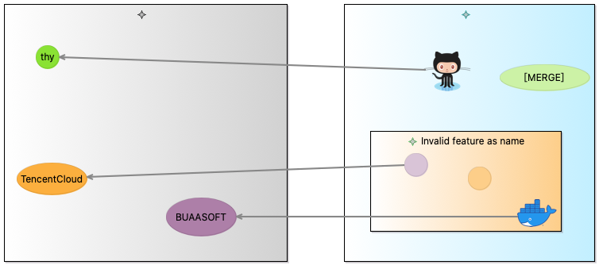
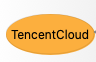
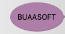
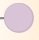

**ZY2121112 田宏远**

# 第二次大作业

### 1.元模型截图

### 2.元模型说明

Jenkins：根结点，即Jenkins系统，其与Config和Pipeline是组合关系，即Jenkins系统由一个Config和多个Pipeline组成

Config：Jenkins的配置项，由Credential、DockerEngine和Server三个类组成，均可以有一个活多个

Credential：凭证，即存储Jenkins系统用来访问代码托管平台git的账号信息，包括凭证名称（唯一），账号名和密码

DockerEngine：远程的Docker Engine信息，包括名称和url两条属性

Server：远程服务器，包含服务器名，ip地址和ssh凭证密码信息

Pipeline：流水线，即Jenkins系统核心功能，可以用来进行自动化部署，由SourceCodeManagement、Trigger、Build、PostBuild组成

SourceCodeManagement：源代码管理，有仓库地址和分支两个属性，并与Credential关联，因为代码获取有时需要凭证信息

Trigger：触发条件，属性是type，设置触发Pipeline执行的条件，如merge

Build：构件操作，由ExecuteShell、ExecuteShellRemote和BuildAndPublishDockerImage组成

ExecuteShell：执行shell命令，属性为command，即需要执行的命令

ExecuteShellRemote：在远处服务器执行shell命令属性为command，即需要执行的命令，与Server关联，即需要执行的目标服务器

BuildAndPublishDockerImage：构件并发布Docker镜像，有两个属性name镜像名称和URI镜像仓库地址，其与DockerEngine关联，需要远程的DockerEngine进行构建。

PostBuild：Build后的操作，一般的流水线不会涉及

PostBuildPlugin：即满足PostBuild要求的插件，是一个抽象类。

### 3.图形建模截图

### 4.元模型与图形模型映射

Config

上图中左侧灰色背景Container

Credential

Server

DockerEngine

Pipeline

上图中右侧蓝色背景Container

SourceCodeManagement

Trigger

Build

蓝色背景中的橙色背景Container

ExecuteShellRemote

ExecuteShell

BuildAndPublishDockerImage

