# README

## 架构图

## 类图

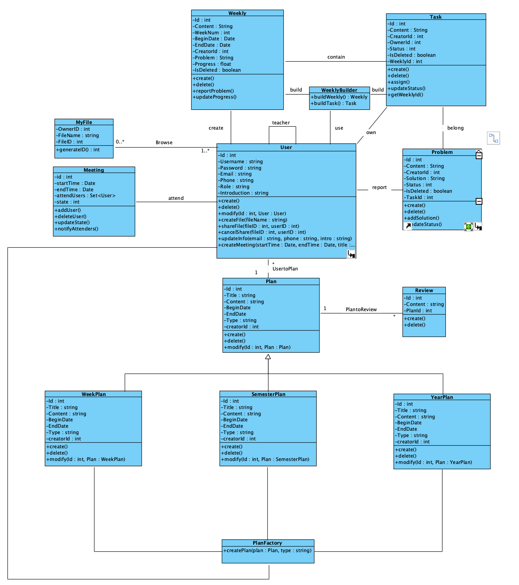

### 设计模式

* 工厂模式
  * `PlanFactory`来创建`YearPlan` 、`SemesterPlan`、`WeekPlan`

* 观察者模式
  * `Meeting`中包含`User`，当状态改变时，调用`notifyAttenders`来通知参加会议人员
* 建造者模式
  * `WeeklyBuilder` 来进行建造`Weekly`和`Task`

## 顺序图

### createPlan

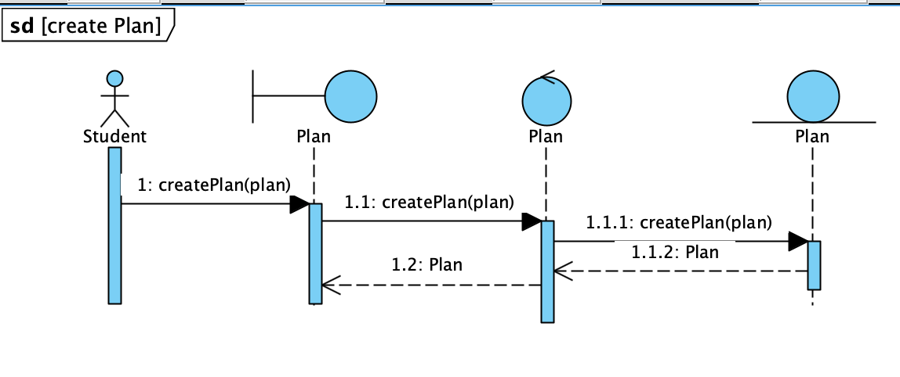

### deletePlan

### modifyPlan

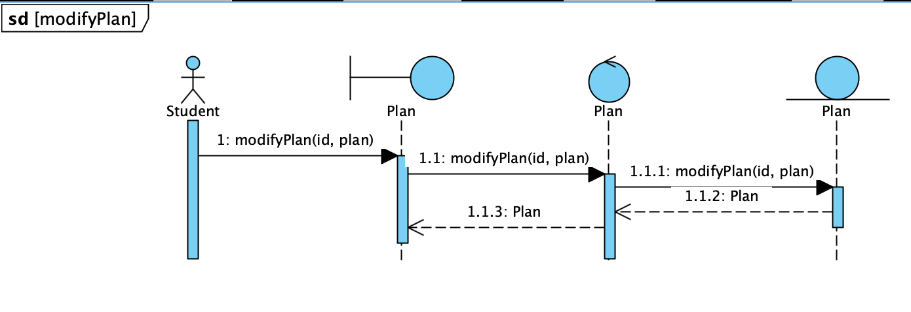

### createReview

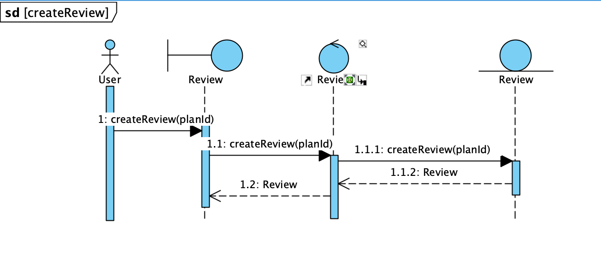

### deleteReview

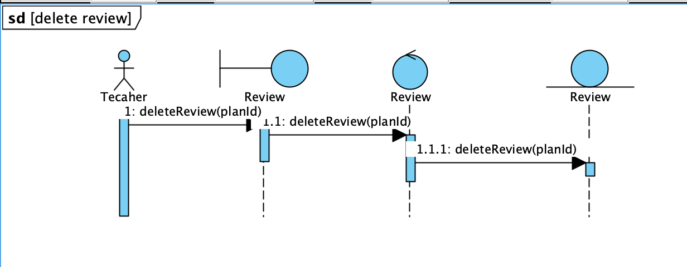

### createFile

描述：首先创建者提供自己的id和文件的名字，然后文件类生成一个文件id，最后返回给用户文件

### reserveMeeting

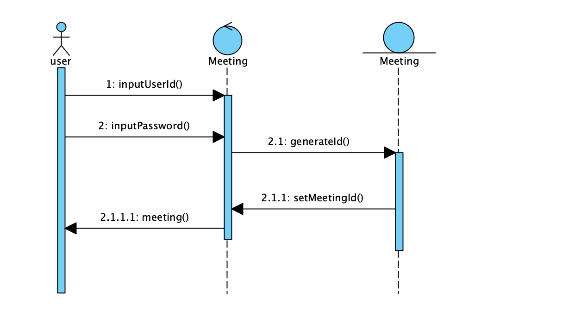

### createWeekly

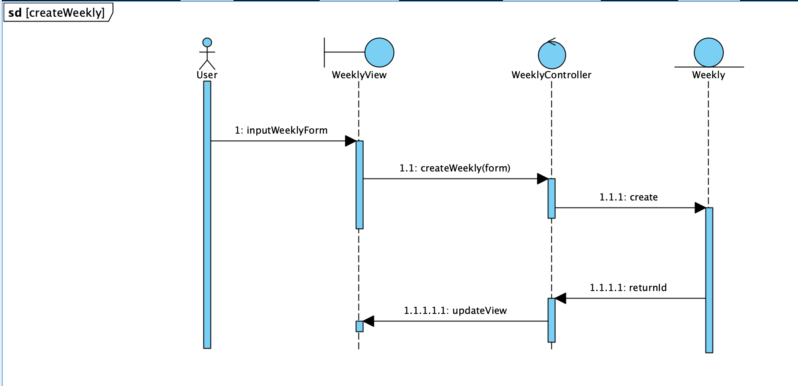

### assignTask

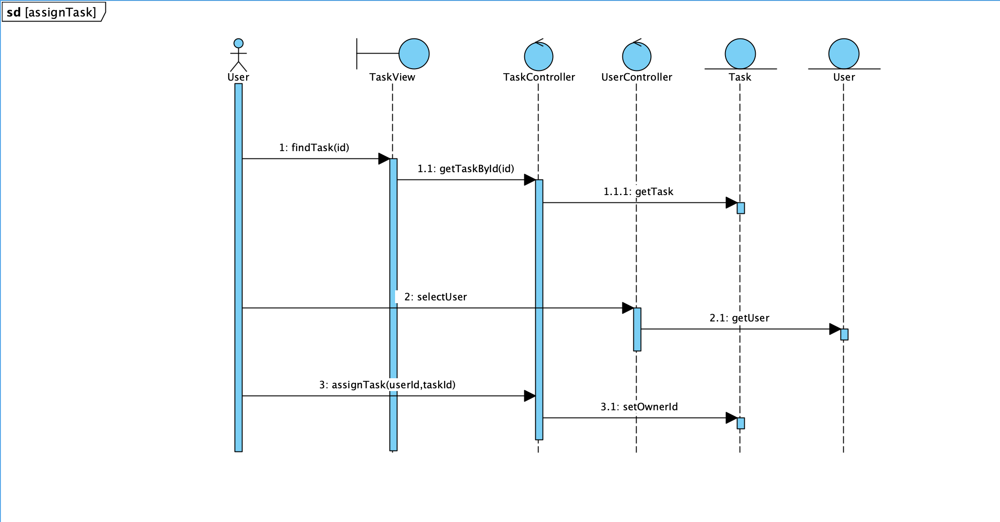

### updateProcession

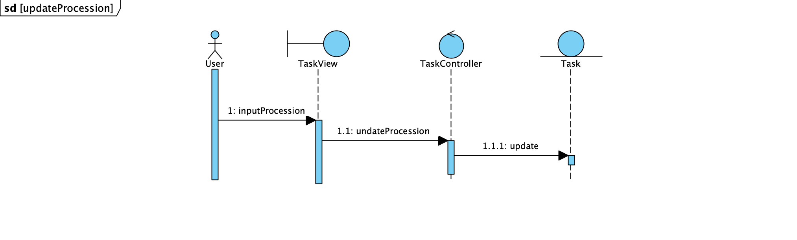

### reportProblem

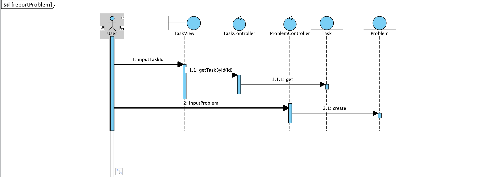

### shareFile

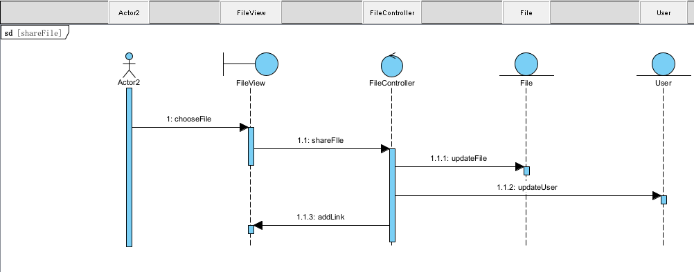

### cancelShare

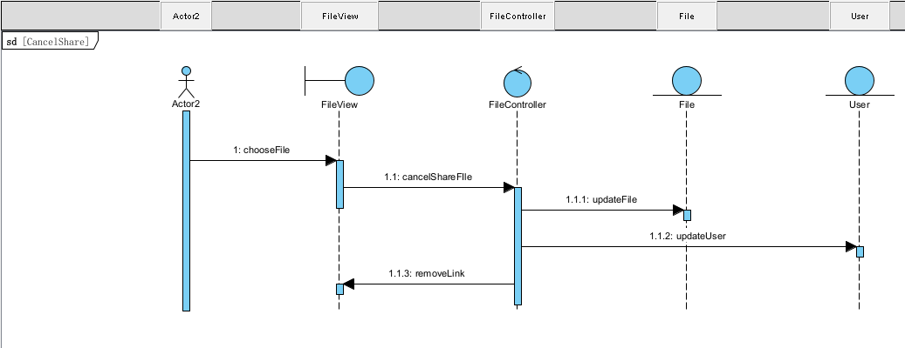

## 分工

* 架构图
  * 小组讨论
* 类图
  * 孟涛： Weekly、Task、Problem
  * 田宏远：User、Plan、Review
  * 蹇熠辉：MyFile
  * 邓程诺：Meeting
* 顺序图
  * 孟涛：createWeekly、 assignTask、updateProcession、reportProblem
  * 田宏远：createReview、deleteReview，create/delete/modifyPlan
  * 蹇熠辉：createFile、shareFile、cancelShare
  * 邓程诺：reserveMeeting

# 第二次更新的区别

- 完善了类图，把上一次缺失的关系连接补充进来了
- 完善了顺序图，补充了updateProcession、reportProblem、create/delete/modifyPlan、shareFile、cancelShare等顺序图
- 新加入了系统的架构图

