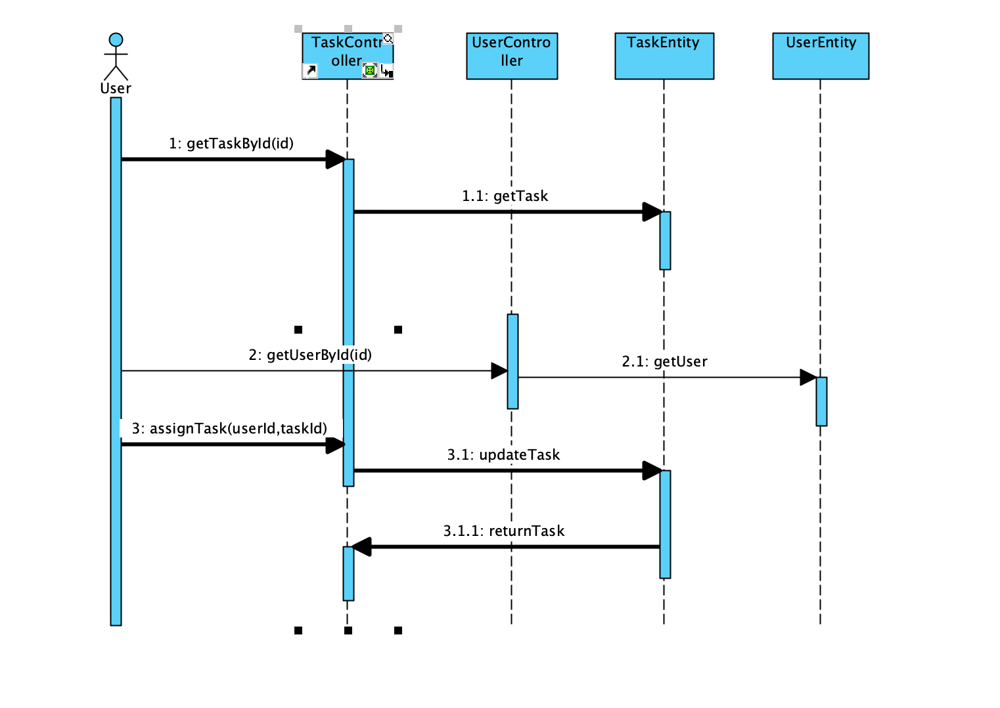

# README

## 类图

Todo

## 顺序图

### assignTask

### createReview

### createFile

描述：首先创建者提供自己的id和文件的名字，然后文件类生成一个文件id，最后返回给用户文件

## reserveMeeting

## 分工

* 类图
  * 孟涛： Weekly、Task、Problem
  * 田宏远：User、Plan、Review
  * 蹇熠辉：MyFile
  * 邓程诺：Meeting
* 顺序图
  * 孟涛：assignTask
  * 田宏远：createReview
  * 蹇熠辉：createFile
  * 邓程诺：reserveMeeting